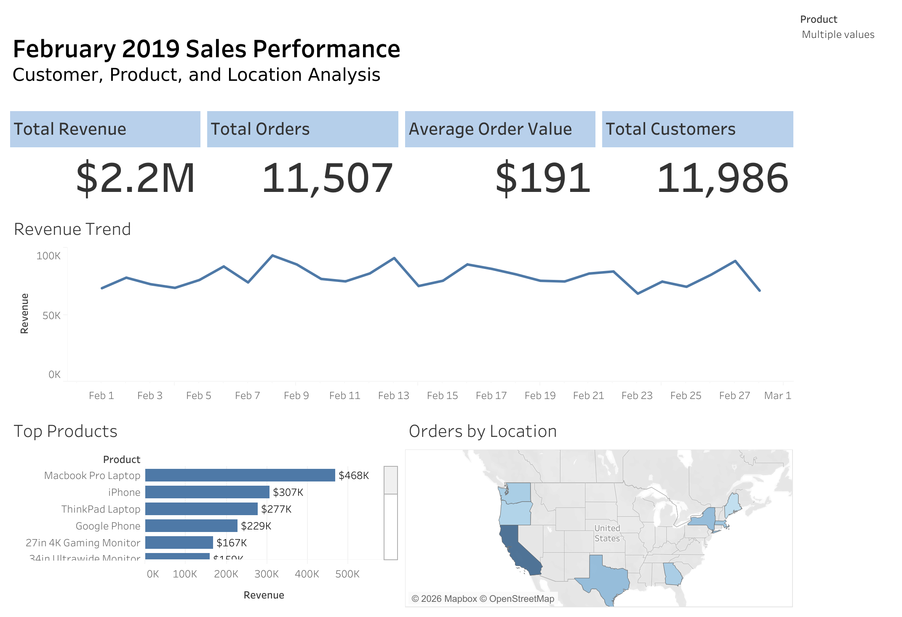

# February 2019 Sales Performance Dashboard

## Overview
This Tableau project explores February 2019 sales performance through an interactive dashboard designed to highlight trends, compare results, and support data-driven decision-making.

## Tools Used
- Tableau 
- Excel 
- Data Visualization
- Dashboard Design

## Live Dashboard
[View on Tableau Public](https://public.tableau.com/app/profile/nicole.rei1978/viz/February2019SalesPerformanceDashboard_17726002846780/February2019SalesPerformanceDashboard)

## Project Goals
- Analyze February 2019 sales performance
- Present key trends in a clear, interactive format
- Create a dashboard that makes results easy to explore

## Dashboard Preview

## Key Takeaways
- Built an interactive Tableau dashboard to review sales performance for February 2019
- Used visual storytelling to make trends and performance easier to interpret
- Published the final dashboard to Tableau Public for portfolio visibility

## Files Included
- Tableau dashboard screenshots
- README documentation
- Link to live Tableau Public project

## Skills Demonstrated
Tableau, dashboard design, data storytelling, KPI reporting, business analysis, data visualization

